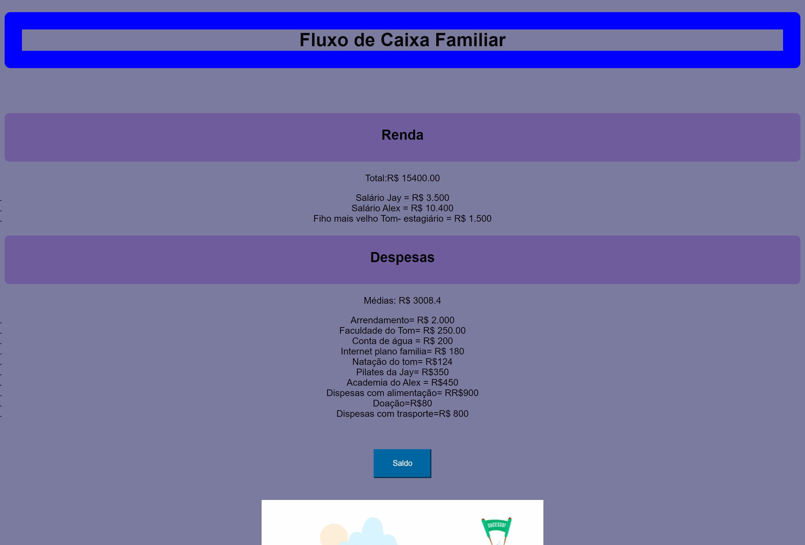

# Fluxo de Caixa Familiar
Crie um objeto que possuirá 2 propriedades, ambas do tipo array e dei uma função que irá calcular o total de renda e despesas e irá mostrar uma mensagem se a família.

 
 

